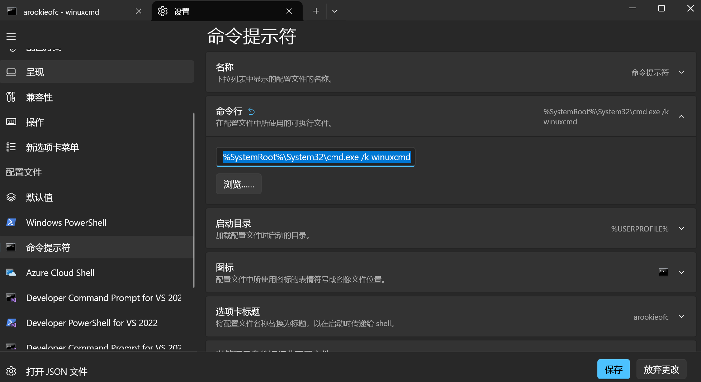

# WinuxCmd

[English](README.md) | 中文

> Windows 原生 shell 的 GNU 风格命令层。


WinuxCmd 为 Windows 提供原生命令实现，包括 `ls`、`cat`、`grep`、`find`、`xargs`、`rm`、`cp`、`mv`、`sed`、`sort`、`uniq` 等常见 Unix/GNU 风格工具。

它是 [winuxsh](https://github.com/unixwin/winuxsh) 使用的命令层，也可以单独安装给 PowerShell、命令提示符、Windows Terminal、构建脚本和 CI 使用。



## 推荐入口：winuxsh

如果你想要的是 Windows 上接近 bash 的终端体验，优先从 [winuxsh](https://github.com/unixwin/winuxsh) 开始：

```text
winuxsh = rubash shell engine + reedline frontend + winuxcmd coreutils
```

winuxsh 提供 bash 兼容 shell 语法、prompt/git 状态、历史、补全和内置 WinuxCmd 命令集，不需要 WSL、MSYS2、Git Bash，也不会落入 PowerShell 语义。

从 [winuxsh releases](https://github.com/unixwin/winuxsh/releases) 下载对应架构的包：

```powershell
# 选择 x64 或 arm64，解压后运行：
.\winuxsh.exe
```

winuxsh release 包会自带架构匹配的 `winuxcmd/winuxcmd.exe` 和激活脚本。这份 WinuxCmd 是给 winuxsh 自己用的，刻意和 winget / 安装器给 PowerShell 安装的 WinuxCmd 隔离。

## PowerShell 安装

如果你只是想在现有 PowerShell 工作流里使用 GNU 风格命令，直接安装 WinuxCmd：

```powershell
winget install caomengxuan666.WinuxCmd
```

然后通过 `winuxcmd` 使用命令：

```powershell
winuxcmd ls -la
winuxcmd grep --color=auto TODO README.md
winuxcmd find . -name "*.cpp"
```

交互式 PowerShell 场景下，包里也带有 `winux.ps1` / `winux.cmd` 辅助脚本。完成 profile 设置后，`winux activate` 可以在当前会话里覆盖 `ls`、`cat`、`rm`、`grep`、`man` 等常见 PowerShell alias；`winux deactivate` 会恢复原来的 alias。

## 渠道要分清

按用途选择对应渠道：

- **winuxsh release**：自带 `winuxcmd/` 目录，只服务 winuxsh；升级 winuxsh 时一起升级。
- **winget / 安装器 release**：给 PowerShell、命令提示符和直接 `winuxcmd <command>` 使用。
- **开发构建**：从本地 build tree 运行 `winuxcmd <command>`，或用本地 hardlink。

正常使用时不要让 winuxsh 依赖 winget 安装的 WinuxCmd。winuxsh 包应该是自包含的，这样 x64 和 arm64 远程构建才可复现，也不会和 PowerShell 安装路径互相污染。

## 用 WPM 管外部工具

WinuxCmd 应该专注维护自己能做好的 GNU 风格命令层。`jq`、`ncat`、`7z`、`zstd`、`yq` 这类完整第三方工具，应该通过 WPM 外部包或其他包管理器提供，而不是在 WinuxCmd 里做不完整内置实现。

WPM 默认会把外部可执行文件安装到指定 WinuxCmd root 目录下。也就是说，`wpm install jq --root <dir>` 会把 `jq.exe` 放在 `winuxcmd.exe` 同级目录里；把这一个目录加入 `PATH` 就够了。需要 DLL 或其他 side-by-side 文件的包，仍然可以在索引里显式声明文件映射。

典型流程：

```powershell
winuxcmd wpm source list
winuxcmd wpm index update
winuxcmd wpm install jq --root "C:\path\to\winuxcmd"
winuxcmd wpm links rebuild --root "C:\path\to\winuxcmd"
```

对 winuxsh bundle 来说，要对它自带的 WinuxCmd 目录运行 WPM，而不是混用 winget 安装路径。外部 helper exe 也应该放在 winuxsh 实际加入 PATH 的同一个目录里。

## 为什么需要 WinuxCmd

Windows 开发者每天都会从文档、CI 日志、issue 评论、shell 片段和肌肉记忆里收到 Linux 风格命令。WinuxCmd 的目标是让这些文本工作流在 Windows 上可用，而不是要求你离开 Windows。

它关注这些点：

- Windows 原生进程行为和路径
- 高频 GNU 风格参数的兼容性
- 能和 `tasklist`、`netstat`、`sc`、`ipconfig` 等 Windows 工具组成可预期的管道
- 对 Windows PowerShell 5.1 这类较旧脚本环境保持可用
- 产物足够小，方便被其他工具内置

## 实际体验

```bash
netstat -ano | grep 8080
tasklist | grep -i chrome
ipconfig | grep -i ipv4
dir /b | grep -E "\.cpp$" | sort | uniq
find . -name "*.cpp" -print0 | xargs -0 grep -n TODO
```

WinuxCmd 不是把 Windows 伪装成 Linux，而是把熟悉的文本工作流接到你已经在用的文件、终端、脚本和 CI 里。

## 命令覆盖

WinuxCmd 目前实现 153 个命令，覆盖这些高频能力：

- 文件工具：`ls`、`cp`、`mv`、`rm`、`mkdir`、`ln`、`stat`、`readlink`、`realpath`
- 文本工具：`cat`、`grep`、`sed`、`sort`、`uniq`、`cut`、`head`、`tail`、`wc`
- 搜索与组合：`find`、`xargs`
- Windows 常用补位：`ps`、`lsof`、`which`、`tree`、`hexdump`、`strings`

如果你关心具体实现了哪些参数、哪些 GNU 语义已经对齐，详细清单在这里：

- [命令兼容性矩阵 (ZH)](DOCS/zh/commands_implementation.md)
- [GNU 兼容清单 (ZH)](DOCS/zh/gnu_coreutils_parity.md)
- [Command Compatibility Matrix (EN)](DOCS/en/commands_implementation_en.md)
- [GNU Parity Ledger (EN)](DOCS/en/gnu_coreutils_parity.md)

## Windows 侧说明

- 未识别命令会回退给父 shell，所以 WinuxCmd 是补足 PowerShell 和 `cmd`，不是替换它们。
- `--version` 由 WinuxCmd 统一处理，不要把单个命令的 version 输出当成独立兼容事项。
- `grep` 这类支持颜色的命令会遵循终端和 `--color` 行为；如果你明确要在管道里保留 ANSI 颜色，用 `--color=always`。
- 如果你主要在交互式 `cmd` 下用它，优先考虑让 Windows Terminal 以 `%SystemRoot%\System32\cmd.exe /k winuxcmd` 启动，而不是配置全局 `AutoRun`。

## 构建

```powershell
cmake --preset vs2022
cmake --build build-vs --target winuxcmd --parallel
```

常用本地检查：

```powershell
ctest --test-dir build-vs -R "^(grep|find|rm)\." --output-on-failure
```

## 更多

- [winuxsh](https://github.com/unixwin/winuxsh)
- [贡献指南（英文）](CONTRIBUTING.md)
- [贡献指南（中文）](CONTRIBUTING_ZH.MD)
- [构建模式文档](DOCS/zh/build_modes.md)
- [自定义容器与基准说明](DOCS/en/custom_containers.md)
