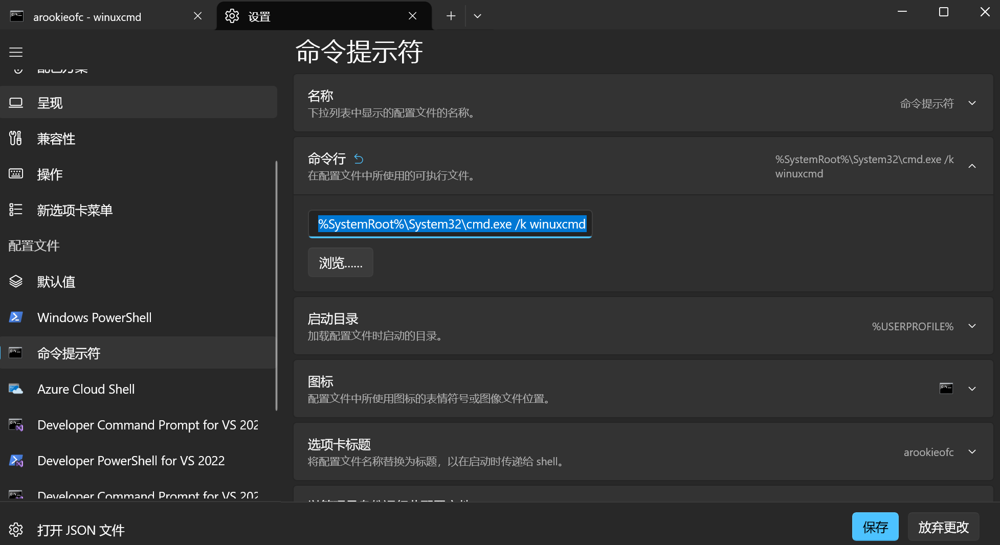

# WinuxCmd: Linux Commands for Windows

English | [中文](README-zh.md)

> Lightweight, native Windows implementation of Linux commands | 900KB only | AI-friendly | Windows  Linux pipelines


## Star History
[](https://www.star-history.com/#caomengxuan666/WinuxCmd&type=date&legend=top-left)

## Quick Start

### Requirements

- **PowerShell 7+** recommended for best experience
  - PowerShell 5.1 (Windows default) is supported but may display color codes as text
  - Install PowerShell 7: `winget install Microsoft.PowerShell` or download from [GitHub](https://github.com/PowerShell/PowerShell/releases)
- Windows 10/11 (x64 or ARM64)
- Administrator rights not required for installation

### One-Command Installation (Recommended)

```powershell
# Run in PowerShell (Admin not required)
irm https://dl.caomengxuan666.com/install.ps1 | iex
```

### Manual Installation

1. Download from Releases
2. Extract to any directory
3. Navigate to the `bin` directory
4. Run `create_links.ps1` to generate command links
   ```powershell
   # For NTFS filesystems (recommended)
   .\create_links.ps1
   
   # For non-NTFS filesystems, use symbolic links
   .\create_links.ps1 -UseSymbolicLinks
   
   # To remove all links later
   .\create_links.ps1 -Remove
   ```
5. Add the `bin` directory to your PATH

### Auto Completion


WinuxCmd completion now includes:

- Project commands implemented by WinuxCmd
- Built-in Windows system commands (curated list with descriptions)
- Windows option completion for common commands (for example: `dir`, `taskkill`, `netstat`, `findstr`, `ipconfig`)

By default, third-party executables in PATH are not auto-listed to avoid noisy suggestions.

#### User-Extensible Completion (Third-Party Commands)

You can add your own command/option completions with a text file.

Default user file path:

`%USERPROFILE%\.winuxcmd\completions\user-completions.txt`

Or set an environment variable to use a custom file:

```powershell
# Temporary (current shell only)
$env:WINUXCMD_COMPLETION_FILE = "C:\path\to\user-completions.txt"

# Persistent (current user)
[Environment]::SetEnvironmentVariable(
  "WINUXCMD_COMPLETION_FILE",
  "C:\path\to\user-completions.txt",
  "User"
)
```

File format:

```text
# Add command: cmd|<command>|<description>
cmd|git|Distributed version control

# Add option: opt|<command>|<option>|<description>
opt|git|pull|Fetch from and integrate with another repository
opt|git|push|Update remote refs along with associated objects
```

Reference template:

`scripts/user-completions.sample.txt`

#### Completion Cache (Fast Startup)

User completion text is parsed once and persisted as a binary cache:

- Source file: `<your-completions-file>`
- Cache file: `<your-completions-file>.cache.bin`

Examples:

- `C:\Users\<you>\.winuxcmd\completions\user-completions.txt`
- `C:\Users\<you>\.winuxcmd\completions\user-completions.txt.cache.bin`

Cache is reused when source file metadata matches (`last write time + file size`), and rebuilt automatically when the source changes.

### Shell Integration Notes (PowerShell + CMD)

1. PowerShell can auto-enter `winuxcmd` through `$PROFILE` (interactive sessions only).
Add the following to:
`C:\Users\<username>\Documents\WindowsPowerShell\Microsoft.PowerShell_profile.ps1`

Replace `$devExe = 'your winuxcmd.exe path'` with your real local path.

```powershell
# Auto-enter WinuxCmd interactive mode
$cliArgs = [Environment]::GetCommandLineArgs() | ForEach-Object { $_.ToLowerInvariant() }
$isNonInteractiveLaunch = ($cliArgs -contains '-command') -or ($cliArgs -contains '-c') -or ($cliArgs -contains '-file') -or ($cliArgs -contains '-f')
if ($Host.Name -eq 'ConsoleHost' -and -not $isNonInteractiveLaunch -and $env:WINUXCMD_BOOTSTRAPPED -ne '1') {
    $env:WINUXCMD_BOOTSTRAPPED = '1'
    $winuxExe = (Get-Command winuxcmd -ErrorAction SilentlyContinue).Source
    if (-not $winuxExe) {
        $devExe = 'your winuxcmd.exe path'
        if (Test-Path $devExe) {
            $winuxExe = $devExe
        }
    }
    if ($winuxExe -and (Test-Path $winuxExe)) {
        & $winuxExe
    }
}
```

2. For CMD, the recommended startup entry is:

Set Windows Terminal startup command to:


```bat
%SystemRoot%\System32\cmd.exe /k winuxcmd
```

3. Avoid hardcoded user-specific paths in scripts. Use dynamic discovery (`where winuxcmd`, `%LOCALAPPDATA%`, `%~dp0`, `$PSScriptRoot`) to keep setups portable.

## Currently Implemented Commands (v0.4.1)

| Command | Description | Supported Flags ( [NOT SUPPORT] = parsed but not implemented ) |
|---------|-------------|---------------------------------------------------------------|
| ls | List directory contents | -l, -a, -A, -h, -r, -t, -n, -g, -o, -1, -C, -w/--width, --color; -b/-B/-c/-d/-f/-F/-i/-k/-L/-m/-N/-p/-q/-Q/-R/-s/-S/-T/-u/-U/-v/-x/-X/-Z [NOT SUPPORT] |
| cat | Concatenate and display files | -n, -E, -s, -T |
| cp | Copy files and directories | -r, -v, -f, -i |
| mv | Move/rename files | -v, -f, -i, -n |
| rm | Remove files/directories | -r, -f, -v, -i |
| mkdir | Create directories | -p, -v, -m MODE |
| rmdir | Remove empty directories | --ignore-fail-on-non-empty, -p/--parents, -v |
| touch | Update file timestamps / create | -a, -c/--no-create, -d/--date, -h/--no-dereference, -m, -r/--reference, -t, --time |
| echo | Display text | -n, -e, -E, -u/--upper, -r/--repeat N |
| head | Output first part of files | -n/--lines, -c/--bytes, -q/--quiet/--silent, -v/--verbose, -z/--zero-terminated |
| tail | Output last part of files | -n/--lines, -c/--bytes, -z/--zero-terminated, -f/--follow [NOT SUPPORT], -F [NOT SUPPORT], --pid [NOT SUPPORT], --sleep-interval [NOT SUPPORT] |
| find | Search for files | -name, -iname, -type (d/f/l), -mindepth, -maxdepth, -print, -print0, -P, -quit; -L/-H/-delete/-exec/-ok/-printf/-prune [NOT SUPPORT] |
| grep | Print lines matching patterns | -E/-F/-G, -e, -f, -i/--no-ignore-case, -w, -x, -z, -s, -v, -m NUM, -b, -n, --line-buffered, -H/-h, --label, --binary-files, -r/-R, --include/--exclude/--exclude-dir, -L/-l, -c, -T, -Z, --color; -P [NOT SUPPORT] |
| sort | Sort lines | -b, -f, -n, -r, -u, -z, -o FILE, -t SEP, -k KEY; -d/-g/-i/-h/-M/-m/-R/-s [NOT SUPPORT] |
| uniq | Report or omit repeated lines | -c, -d, -f NUM, -i, -s NUM, -u, -w NUM, -z; -D, --group [NOT SUPPORT] |
| cut | Cut fields from lines | -d DELIM, -f LIST, -s, -z; -b/-c/--output-delimiter [NOT SUPPORT] |
| which | Locate a command in PATH/PATHEXT | -a; --skip-dot/--skip-tilde/--show-dot/--show-tilde [NOT SUPPORT] |
| env | Print/modify environment | -i/--ignore-environment, -u NAME, -0/--null; -S/--split-string, -C/--chdir, running COMMAND [NOT SUPPORT] |
| wc | Count lines/words/bytes | -c, -l, -w, -m, -L |
| pwd | Print working directory | -L (logical), -P (physical) |
| ps | Report process status | -e/-A/-a/-x (all processes), -f (full format), -l (long format), -u (user format), --user USER (filter by user), -w (wide output), --no-headers, --sort=KEY (sort by column) |
| tee | Read from stdin and write to stdout and files | -a/--append, -i/--ignore-interrupts, -p/--diagnose |
| chmod | Change file mode bits | -c/--changes, -f/--silent/--quiet, -v/--verbose, -R/--recursive, --reference |
| date | Print or set system date/time | -d/--date, -u/--utc, +FORMAT; -s/--set [NOT SUPPORT] |
| df | Report file system disk space usage | -h/--human-readable, -H/--si, -T/--print-type, -i/--inodes, -t/--type, -x/--exclude-type, -a/--all |
| du | Estimate file space usage | -h/--human-readable, -H/--si, -s/--summarize, -c/--total, -d/--max-depth, -a/--all |
| kill | Send a signal to processes | -l/--list, -s/--signal; -9/-KILL/-15/-TERM [supported signals] |
| ln | Make links between files | -s/--symbolic, -f/--force, -i/--interactive, -v/--verbose, -n/--no-dereference |
| diff | Compare files line by line | -u/--unified, -q/--brief, -i/--ignore-case, -w/--ignore-all-space, -B/--ignore-blank-lines, -y/--side-by-side [NOT SUPPORT], -r/--recursive [NOT SUPPORT] |
| file | Determine file type | -b/--brief, -i/--mime, -z/--compress, --mime-type, --mime-encoding |
| realpath | Print the resolved absolute path | -e/--canonicalize-existing, -m/--canonicalize-missing, -s/--strip, -z/--zero |
| xargs | Build and execute command lines from input | -n/--max-args, -I/--replace, -P/--max-procs, -t/--verbose, -0/--null; -d/--delimiter [NOT SUPPORT] |
| sed | Stream editor | -n/--quiet, -e/--expression, -f/--file, -i/--in-place [basic substitution: s/pattern/replacement/flags] |
| tree | List contents of directories in a tree-like format | -a/--all, -d/--directories-only, -L/--max-depth, -f/--full-path, -I/--ignore-pattern, -P/--pattern, -C/--color, -s/--size, -t/--time-sort, -o/--output |
| lsof | List open files and handle-backed resources | -p PID/--pid PID (filter by process), -a/--all (include unnamed and non-file handles), -i/--internet (internet-focused view), -F/--field (machine-readable output), -n/--numeric (keep native device paths), --no-headers, -t/--timeout-ms MS (NtQueryObject timeout) |

## Why WinuxCmd?

### The Problem

AI tools (GitHub Copilot, Cursor, Claude Code) often output Linux commands when working on Windows, causing errors like:

```bash
# AI outputs this:
ls -la
find . -name "*.cpp" -exec grep -l "pattern" {} \;

# But Windows needs:
Get-ChildItem -Force
Get-ChildItem -Recurse -Filter "*.cpp" | Select-String "pattern"
```

Worse, mixing native Windows tools with Linux-style filtering is impossible without a bridge:

```bash
# This fails in plain PowerShell/CMD:
netstat -ano | grep 8080
tasklist | grep chrome | awk '{print $2}'
```

### Existing solutions have drawbacks

- WSL: Heavy, requires virtualization
- Git Bash/MSYS2: Separate terminal, integration issues
- PowerShell Aliases: Limited, parameter incompatible

### Our Solution

WinuxCmd provides native Linux command syntax on Windows **and bridges Windows tools with Linux pipelines** - no emulation layers, no separate terminal.

```bash
# These all work out of the box with WinuxCmd:
netstat -ano | grep 8080
tasklist | grep chrome
ipconfig | grep -i "ipv4"
dir /b | sort | uniq -c
```

## Technical Highlights

### 1. Minimal Distribution

WinuxCmd packages contain only `winuxcmd.exe` (single executable) and setup scripts. Command links are generated on-demand by the user using `create_links.ps1`:

```bash
# After running create_links.ps1, all commands become links:
$ ls -i *.exe
12345 winuxcmd.exe   # The main executable
12345 ls.exe         # Hardlink to winuxcmd.exe
12345 cat.exe        # Hardlink to winuxcmd.exe
12345 cp.exe         # Hardlink to winuxcmd.exe

# Result: Single executable + on-demand links = ultra-fast downloads
```

**Advantages:**
- Smaller download size (single ~900KB executable instead of 34 separate files)
- Users choose which commands to install
- Automatic fallback: if hardlinks fail, uses symbolic links
- Works on both NTFS and non-NTFS filesystems

### 2. Extreme Size Optimization

```bash
# Size comparison (Release build, x64):
WinuxCmd (static):      ~900 KB
WinuxCmd (dynamic):     ~150 KB
BusyBox Windows:        ~1.24 MB
GNU coreutils (MSYS2):  ~5 MB
Single ls.exe (C/CMake):~1.5 MB
```

### 3. Performance

- Startup time: 10-25ms (vs 70-80ms for GNU coreutils/MSYS2, Git Bash)
- Memory usage: < 2MB per process
- No runtime dependencies: Pure Win32 API

### 3.1 Full Execution Benchmark: WinuxCmd vs uutils coreutils

Tested complete command execution (startup + execution + exit) with 1000 files directory, 20 iterations each (lower is better):

| Command | WinuxCmd (ms) | uutils (Rust) (ms) | Ratio | Winner |
|---------|---------------|-------------------|-------|--------|
| ls      | 6.30          | 7.27              | 0.87x | WinuxCmd |
| cat     | 6.19          | 7.01              | 0.88x | WinuxCmd |
| head    | 6.27          | 6.79              | 0.92x | WinuxCmd |
| tail    | 6.34          | 6.84              | 0.93x | WinuxCmd |
| grep    | 6.42          | 5.99              | 1.07x | uutils |
| sort    | 6.31          | 7.27              | 0.87x | WinuxCmd |
| uniq    | 6.23          | 6.84              | 0.91x | WinuxCmd |
| wc      | 6.21          | 6.81              | 0.91x | WinuxCmd |

**Summary:**
- WinuxCmd wins in 7/8 commands (87.5%)
- Average execution time: WinuxCmd 6.28ms, uutils 6.85ms
- Overall speedup: **1.09x faster** than uutils (Rust)
- Best performance: ls & sort (1.15x faster)
- Only grep is slower by 1.07x

> **Test Configuration:**
> - Test Environment: Windows 10 x64
> - Test Data: 1000 files directory
> - Iterations: 20 runs per command
> - Test Method: `Measure-Command { ls }` (complete execution including startup)
> - Versions: WinuxCmd v0.4.5, uutils coreutils v0.6.0
> - Date: February 25, 2026

### 4. Custom Containers

WinuxCmd implements custom C++23 containers for optimal performance:

#### SmallVector
Stack-allocated vector with Small Buffer Optimization (SBO):
- 5-10x faster than std::vector for small sizes (< 64 elements)
- Reduces heap allocations by 80%+ in typical command scenarios
- Automatic fallback to heap when capacity exceeded

**Benchmark Results:**
```
BM_SmallVectorPushBack/4    6.13 ns    (vs StdVector: 45.0 ns, 7.3x faster)
BM_SmallVectorPushBack/8    11.1 ns    (vs StdVector: 47.8 ns, 4.3x faster)
BM_SmallVectorPushBack/64   86.0 ns    (vs StdVector: 106 ns,  1.2x faster)
```

#### ConstexprMap
Compile-time hash map for fixed-size key-value pairs:
- Zero initialization overhead
- O(1) lookup at runtime
- Perfect for configuration tables and mappings

**Benchmark Results:**
```
BM_ConstexprMapLookup       99.6 ns    (16.67 G/s iteration)
BM_UnorderedMapLookup       34.8 ns    (113.33 M/s iteration)
BM_ConstexprMapIterate      1.19 ns    (constant-time access)
```

**Optimized Commands:**
- find, cat, env, mv, xargs, grep, sed, head, tail, tee, wc, uniq, which (SmallVector)
- tail (ConstexprMap for suffix multipliers: K, M, G, T, P, E)

### 5. Cross-Platform Pipeline

WinuxCmd's pipeline is a **first-class bridge** between native Windows commands and Linux utilities. The shell's pipe operator (`|`) connects them seamlessly - output from any Windows command flows directly into Linux filters, and vice versa.

```bash
# Network: find which process owns port 8080
netstat -ano | grep 8080

# Process: find Chrome PIDs
tasklist | grep -i chrome

# Disk: list top 10 largest files
dir /s /b /a-d | xargs wc -c 2>nul | sort -n | tail -10

# Network config: show only IPv4 addresses
ipconfig | grep -i "ipv4"

# Open files: inspect a specific port
lsof -i

# Environment: grep for proxy settings
set | grep -i proxy
```

No special syntax, no adapters - Windows stdout IS Linux stdin.

### 6. AI-Friendly by Design

```bash
# AI can now safely output Linux commands on Windows
ls -la | grep ".cpp" | xargs cat
# -> Works directly with WinuxCmd installed
```

### 7. Color Support

```bash
# ls with color support (enabled by default)
ls --color=auto
ls --color=always

# Color output works in both terminal and piped scenarios
ls --color=always | grep "\.cpp$"
```


## Technical Details

### Compilation (MSVC Only)

```bash
# Build with Visual Studio 2022+
mkdir build && cd build
cmake .. -G "Ninja" -DCMAKE_BUILD_TYPE=Release
cmake --build .

# Advanced options with build modes
cmake .. -DBUILD_MODE=DEV      # Development mode (fast incremental builds)
cmake .. -DBUILD_MODE=RELEASE   # Release mode (optimized performance)
cmake .. -DBUILD_MODE=DEBUG_RELEASE  # Release optimizations with debug features

# Other options
cmake .. -DUSE_STATIC_CRT=ON -DENABLE_TESTS=ON -DGENERATE_MAP_INFO=ON
```

### Architecture

- Language: Modern C++23 with modules
- Windows API: Pure Win32 (no MFC/ATL)
- Compilation: MSVC extensions for optimal performance
- Linking: Static CRT by default for portability

### Design Choices

- Single executable distribution: Minimal download, on-demand link generation
- Hardlinks with symbolic link fallback: Best performance on NTFS, compatibility elsewhere
- Static linking: No VC++ runtime dependencies
- No RTTI/Exceptions: Reduced binary size
- Module-based: Faster compilation, cleaner dependencies

## Usage Examples

### Basic Usage

```bash
# Direct usage (no activation needed)
winux ls -lah
winux cat -n file.txt
winux cp -rv source/ dest/
winux rm -rf node_modules/
winux mkdir -p path/to/new/dir

# Or activate for direct command access
winux activate
ls -lah
cat -n file.txt
```

### Management Commands

```bash
# WinuxCmd v0.1.4 - GNU Coreutils for Windows
# ===================================================

# Management Commands:
winux activate          - Enable GNU commands
winux deactivate        - Restore original commands
winux status            - Check activation status
winux list              - List available commands
winux version           - Show version
winux help              - Show this help

# GNU Commands (direct):
winux ls -la            - List files
winux cp source dest    - Copy files
winux mv source dest    - Move files
winux rm file           - Remove file
winux cat file          - Show file content
winux mkdir dir         - Create directory

# Direct Access:
winuxcmd --help         - Show winuxcmd help
```

### Activation Example

```bash
# Activate WinuxCmd
winux activate

# Output:
# Activating WinuxCmd...
#   cat
#   cp
#   mkdir
#   ls
#   mv
#   rm
# Activation complete!
# Available WinuxCmd Commands:
# =============================
#   cat -> cat.exe [ok]
#   cp -> cp.exe [ok]
#   ls -> ls.exe [ok]
#   mkdir -> mkdir.exe [ok]
#   mv -> mv.exe [ok]
#   rm -> rm.exe [ok]

# Now you can use commands directly
ls -la
cat file.txt
```

### Deactivation Example

```bash
# Deactivate WinuxCmd
winux deactivate

# Output:
# Deactivating WinuxCmd...
# Deactivation complete! All original commands restored.
```

### Integration with PowerShell

```powershell
# Direct usage
winux ls -la | Select-Object -First 10
Get-Process | winux grep "chrome"

# With activation
winux activate
ls -la | Select-Object -First 10
Get-Process | grep "chrome"
```

### Cross-Platform Pipeline Examples

```bash
# Find which process is using port 8080
netstat -ano | grep 8080

# List all listening ports and filter
netstat -an | grep LISTENING | awk '{print $2}' | sort -u

# Find Chrome process IDs
tasklist | grep -i chrome | awk '{print $2}'

# Check open files/connections for a port
lsof -i

# Show IPv4 addresses only
ipconfig | grep -i "ipv4"

# Count files by extension in current directory
dir /b /a-d | grep -oP '\.[^.]+$' | sort | uniq -c | sort -rn

# Search environment variables
set | grep -i path | head -5
```

### lsof Notes (Windows-specific)

`lsof` on Windows uses handle enumeration and `NtQueryObject`.

- Some handle types (for example, named pipes or certain pending network objects) can block in `NtQueryObject`; WinuxCmd runs these queries in a worker thread with `--timeout-ms` protection.
- Inspecting handles from other processes may require `SeDebugPrivilege`; when privilege is unavailable, WinuxCmd degrades gracefully and reports partial-output warnings instead of crashing.

### Batch Scripts

```batch
@echo off
:: Now you can use Linux commands in batch files
ls -la > files.txt
find . -name "*.tmp" -delete
```

## Roadmap

### Phase 1: Core Utilities (Current)

- ls, cat, cp, mv, rm, mkdir, echo
- grep, find, wget, curl, tar, gzip
- chmod, chown, touch, ln, pwd

### Phase 2: Advanced Tools

- sed, awk, xargs, tee
- ssh, scp, rsync
- git-like porcelain commands

### Phase 3: Ecosystem

- Package manager integration
- VS Code/IDE plugins
- Docker/CI support

## Contributing

We welcome contributions! As a student-led project, we especially encourage:

- Command implementations (follow our template)
- Documentation improvements
- Bug reports and testing

See CONTRIBUTING.md for details.

### Good First Issues

- Add -h/--help support to all commands
- Implement wc (word count) command
- Add colored output to ls
- Improve error messages

## FAQ

### Q: How is this different from WSL?

A: WSL is a full Linux subsystem. WinuxCmd is native Windows executables that understand Linux syntax.

### Q: Does it replace PowerShell?

A: No, it complements PowerShell. Use Linux commands when scripting, PowerShell for Windows management.

### Q: Is it safe to use?

A: Yes. All code is open-source, no internet connections, no telemetry.

### Q: Why C++ instead of Rust/Go?

A: Maximum performance, minimal dependencies, and direct Windows API access.

### Q: Will enabling WinuxCmd shell completion break native Windows commands?

A: No. WinuxCmd has a fallback mechanism. Commands it cannot parse are executed by native Windows command shell.

### Q: Will completion ranking be optimized by user behavior?

A: Yes, this is planned for a future update.

## Documentation

- [API Reference](DOCS/en/overview.md)
- [Building from Source](DOCS/en/commands_implementation_en.md)
- [Command Compatibility Matrix](DOCS/en/commands_implementation_en.md)
- [Testing Framework](DOCS/en/testing_framework_en.md)
- [Option Handling Guide](DOCS/en/option-handling.md)
- [Build Modes Guide](DOCS/en/build_modes_en.md)

## About the Author

This project is developed as a personal initiative to improve the Windows development experience.

Contact: <2507560089@qq.com>
GitHub: @caomengxuan666
Website: blog.caomengxuan666.com
Product: https://dl.caomengxuan666.com

## License
MIT License (c) 2026 caomengxuan666. See LICENSE for details.
