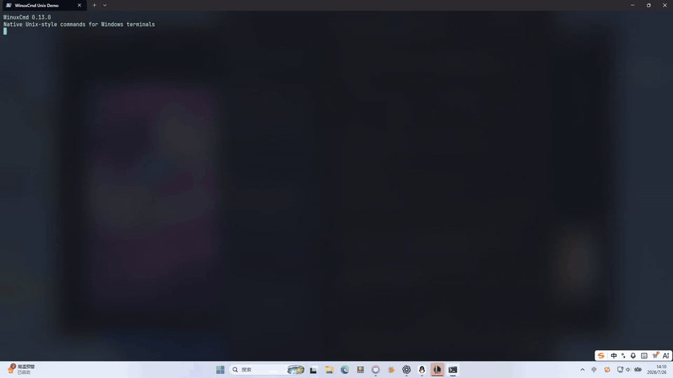

# WinuxCmd

[English](README.md) | [中文](README-zh.md)

> Native Windows command-line tools with a Unix-shaped workflow.


WinuxCmd gives Windows terminals a compact GNU-style command layer: `ls`,
`cat`, `grep`, `find`, `xargs`, `sed`, `sort`, `uniq`, `cp`, `mv`, `rm`,
and more.

The 0.14 line also introduces a clearer WPM model: WinuxCmd ships the core
commands, while WPM manages portable sidecar binaries such as `awk`, `jq`, `rg`,
`fd`, `fzf`, `bat`, `yq`, `7z`, and `ffmpeg` from a separate package index.

```powershell
winuxcmd ls -la
winuxcmd grep --color=auto TODO README.md
winuxcmd find . -name "*.cpp" -print0

winuxcmd wpm source list -v
winuxcmd wpm search json
winuxcmd wpm info jq
```

## Demo



High-resolution recording: [winuxcmd-unix-demo.mp4](DOCS/media/winuxcmd-unix-demo.mp4).

## Why It Exists

Windows developers constantly paste Linux-shaped commands from docs, CI logs,
issue comments, and muscle memory. WinuxCmd keeps those text workflows useful
without forcing you into WSL, MSYS2, Git Bash, or PowerShell-only semantics.

What matters:

- Native Windows executable, process, and path behavior.
- Familiar GNU-style flags where they are useful.
- Predictable pipelines with Windows tools such as `tasklist`, `netstat`,
  `sc`, and `ipconfig`.
- Small artifacts that can be bundled by shells, installers, CI images, and
  portable tool folders.

## Install

For PowerShell, Command Prompt, Windows Terminal, build scripts, and CI:

```powershell
winget install caomengxuan666.WinuxCmd
```

Then run commands through `winuxcmd`:

```powershell
winuxcmd --version
winuxcmd ls -la
winuxcmd grep -n TODO src
```

The installer also includes `winux.ps1` and `winux.cmd`. In an interactive
PowerShell session, `winux activate` can expose common commands such as `ls`,
`cat`, `rm`, `grep`, and `man` without replacing your whole shell.

## WPM

WPM is WinuxCmd's small package and link manager. It is intentionally not a
replacement for winget.

Use WPM for:

- Portable command-line sidecars placed beside `winuxcmd.exe`.
- Single `.exe` downloads and simple `.zip` archives with explicit file maps.
- Unix-like helper tools that are useful in Windows shell workflows.
- Rebuilding hardlinks so commands can be called directly by name.

Use winget for:

- GUI apps, runtimes, SDKs, services, drivers, and system-wide installers.
- Tools that need vendor setup, PATH policy, file associations, or background
  components.

The official WPM source lives outside this repository:

- Source repo: [unixwin/wpm-source](https://github.com/unixwin/wpm-source)
- Raw index: `https://raw.githubusercontent.com/unixwin/wpm-source/main/index.json`
- CDN index: `https://cdn.jsdelivr.net/gh/unixwin/wpm-source@main/index.json`

Typical flow:

```powershell
winuxcmd wpm source list -v
winuxcmd wpm index update
winuxcmd wpm search editor
winuxcmd wpm info jq
winuxcmd wpm links rebuild --root "C:\path\to\winuxcmd"
```

Packages remain `index-only` until the source provides architecture-specific
URLs, SHA-256 hashes, and file mappings. That keeps WPM simple and auditable:
metadata can be listed early, but only verified binary artifacts are installed.

To update the WinuxCmd installation managed by WPM, run:

```sh
winuxcmd wpm update winuxcmd
```

WPM stages and verifies the new artifact, then uses a helper process to replace
the executable after the current process exits. This updates that WinuxCmd
root; it does not change the copy bundled inside a separate Winuxsh release.

## Winuxsh

[winuxsh](https://github.com/unixwin/winuxsh) is the recommended entry point if
you want a bash-like Windows terminal:

```text
winuxsh = rubash shell engine + reedline frontend + winuxcmd command layer
```

The winuxsh release bundle carries its own architecture-matched `winuxcmd/`
directory. Keep that copy separate from a winget-installed WinuxCmd so x64 and
arm64 shell bundles stay reproducible.

### Optional I18N

Install the optional language package through WPM, then enable it explicitly:

```sh
winuxcmd wpm install winuxcmd-i18n-zh-cn
```

Winuxsh is the primary supported setup. Add this line to `~/.winuxshrc` so
every new Winuxsh session enables the catalog:

```sh
export WINUX_LANG=zh-CN
```

Reload the profile or start a new shell, then run `winuxcmd ls --help`.
`WINUX_LANG=off` disables the catalog. The Winuxsh `export` builtin changes the
current shell and its children; placing the same command in `~/.winuxshrc` is
the persistent Winuxsh configuration.

## What Ships

WinuxCmd currently implements 171 commands, including practical coverage across:

- Files: `ls`, `cp`, `mv`, `rm`, `mkdir`, `ln`, `stat`, `readlink`, `realpath`
- Text: `cat`, `grep`, `sed`, `sort`, `uniq`, `cut`, `head`, `tail`, `wc`
- Search and composition: `find`, `xargs`
- Windows-friendly utilities: `ps`, `lsof`, `which`, `tree`, `hexdump`,
  `strings`
- WPM: `wpm source`, `wpm index`, `wpm list`, `wpm search`, `wpm info`,
  `wpm install`, `wpm links`

Detailed compatibility references:

- [Command Compatibility Matrix (EN)](DOCS/en/commands_implementation_en.md)
- [GNU Parity Ledger (EN)](DOCS/en/gnu_coreutils_parity.md)
- [命令兼容性矩阵 (ZH)](DOCS/zh/commands_implementation.md)
- [GNU 兼容清单 (ZH)](DOCS/zh/gnu_coreutils_parity.md)

## Build

```powershell
cmake --preset vs2022
cmake --build build-vs --target winuxcmd --parallel
```

Useful checks:

```powershell
build-vs\tests\winuxcmd-tests.exe --gtest_filter=wpm.*
ctest --test-dir build-vs -R "^(grep|find|rm)\." --output-on-failure
```

## Links

- [winuxsh](https://github.com/unixwin/winuxsh)
- [WPM source](https://github.com/unixwin/wpm-source)
- [Contributing Guide](CONTRIBUTING.md)
- [Build Modes](DOCS/en/build_modes_en.md)
